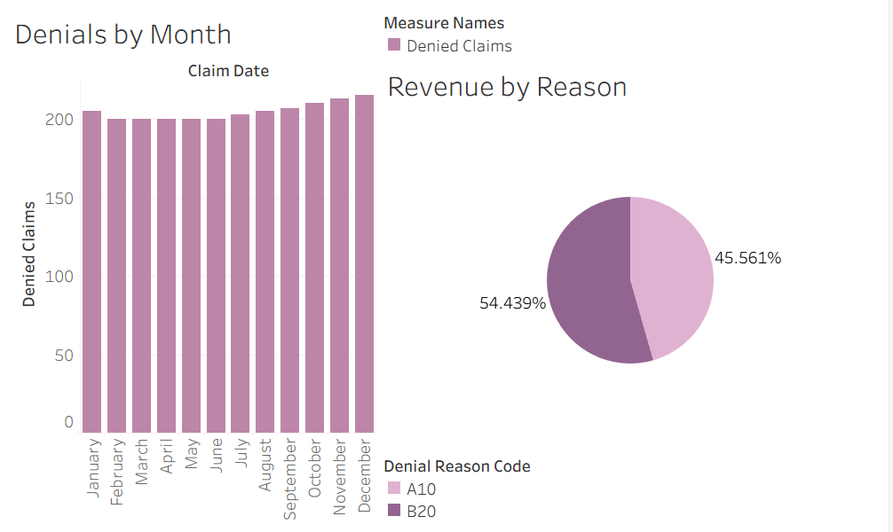
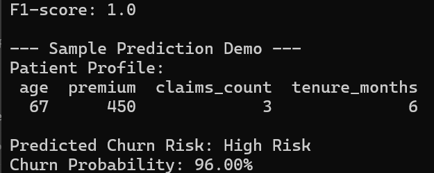
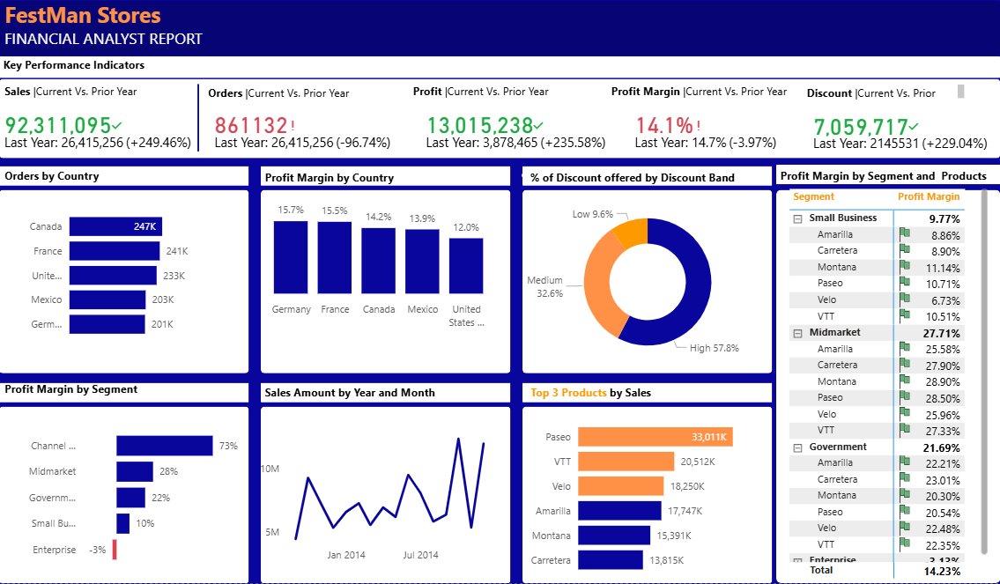

# Hi, I'm Jil 👋  
Healthcare Data Analyst | SQL • Power BI • Python  

I specialize in analyzing healthcare data to uncover insights that improve patient outcomes, reduce costs, and optimize operations.
# Jil Burton — Data Analyst Portfolio

**Remote | Healthcare Claims | SQL | Power BI | Python**

💼 Healthcare Data Analyst specializing in claims analysis, cost optimization, and patient risk insights.

---

## 🔍 Quick Navigation
| 📊 Project                         | 🛠 Tool        | 🔗 Access                                                                     |
| ---------------------------------- | -------------- | ----------------------------------------------------------------------------- |
| Medicare Denials Dashboard | Tableau Public | [View Dashboard](https://public.tableau.com/app/profile/jil.burton/viz/Medicare_Denials_Dashboard/MedicareDenialsOverview?publish=yes) |
| Revenue Cycle Performance Analysis | Excel + SQL | [Download Excel](./jil-portfolio/project-2-revenue-cycle/RevenueCycle_KPI.xlsx) |
| Revenue Cycle Data Files | Excel + SQL | [View CSV](./jil-portfolio/project-2-revenue-cycle/RevenueCycle_KPI.csv) • [View SQL](./jil-portfolio/project-2-revenue-cycle/revenue_cycle_kpi.sql) |
| Healthcare Churn Model | Python | [nbViewer](https://nbviewer.org/github/moonwalker2108/jilburtonDA/blob/main/jil-portfolio/project-3-churn/churn_model.py) |
| Financial Performance Analysis (Retail) | Power BI | [View Project](./jil-portfolio/project-4-financial-performance-analysis) • [Download PBIX](./jil-portfolio/project-4-financial-performance-analysis/festman-financial-report.pbix) |
| Healthcare Claims & Risk Dashboard | Power BI | [View Project](./jil-portfolio/project-5-claims-risk-analytics-dashboard) • [Download PBIX](./jil-portfolio/project-5-claims-risk-analytics-dashboard/claims_risk_dashboard.pbix) |

---

## 🔍 What I Do
- Analyze healthcare claims, revenue cycle, and patient data  
- Build dashboards and reports using Power BI and SQL  
- Identify trends, inefficiencies, and cost-saving opportunities  
- Translate data into actionable business insights  

---

## 🏥 Featured Projects

### 📊 Medicare Claims & Denials Analysis  
SQL | Tableau | Healthcare Analytics  

Analyzed Medicare claims data to identify denial trends, root causes, and revenue loss drivers. 

#### 🔍 Key Highlights
- Identified patterns in denied claims and payer behavior
- Analyzed financial impact of claim denials
- Built interactive dashboard to visualize denial trends

#### 💡 Business Value
- Helps reduce claim denials and revenue loss
- Supports payer negotiation and billing improvements
- Improves revenue cycle performance

#### 🛠 Tools & Techniques
- SQL (data extraction & transformation)
- Tableau (dashboard development & visualization)

🔗 [View Interactive Dashboard](https://public.tableau.com/views/Medicare_Denials_Dashboard/MedicareDenialsOverview?:language=en-US&:sid=&:redirect=auth&:display_count=n&:origin=viz_share_link)  
📁 [View Full Case Study](https://github.com/moonwalker2108/jilburtonDA/tree/main/jil-portfolio/project-1-medicare-denials)

---
### 📈 Revenue Cycle Performance Analysis  
SQL | Excel | Healthcare Operations  

Analyzed key revenue cycle metrics to evaluate billing efficiency and accounts receivable performance.

#### 🔍 Key Highlights
- Tracked DNFB and billing delays  
- Measured discharge-to-bill lag  
- Analyzed A/R aging  

#### 💡 Business Value
- Identifies revenue delays  
- Improves cash flow visibility

#### 🛠 Tools & Techniques
- SQL (data extraction and KPI calculations)
- Excel (Power Query, pivot tables, reporting)

🔗 [View Project](./jil-portfolio/project-2-revenue-cycle)  
📁 [Download Excel](./jil-portfolio/project-2-revenue-cycle/RevenueCycle_KPI.xlsx) • [View CSV](./jil-portfolio/project-2-revenue-cycle/RevenueCycle_KPI.csv) • [View SQL](./jil-portfolio/project-2-revenue-cycle/revenue_cycle_kpi.sql)

---

### 🤖 Patient Churn Prediction Model  
Python | Pandas | Scikit-learn | Predictive Analytics  

Built a machine learning model to identify patients at risk of churn using behavioral and utilization-based features. This project demonstrates how predictive analytics can support proactive outreach and retention strategies in healthcare.

#### 🔍 Key Highlights
- Cleaned and prepared structured patient data for modeling  
- Engineered features related to engagement, utilization, and risk  
- Trained a classification model to predict patient churn  
- Demonstrated model output using a sample patient prediction scenario  

#### 📈 Business Value
- identify high-risk patients earlier  
- Supports targeted retention strategies and outreach efforts  
- Translates model results into actionable healthcare insights
- improves long-term patient engagement 

#### 🛠 Tools & Techniques
- Python  
- Pandas  
- Scikit-learn  
- Data preprocessing  
- Classification modeling  
- Model evaluation  

#### 📸 Model Demo

📁 **[View Full Project Files](https://github.com/moonwalker2108/jilburtonDA/tree/main/jil-portfolio/project-3-churn)**

## 🛠 Tools & Skills
SQL | Excel | Power BI | Python | Tableau | Data Analysis | Healthcare Analytics  

---
### 💰 Financial Performance Analysis (Retail)

Power BI | Financial Analytics

Analyzed retail financial data to evaluate revenue trends, profitability, and overall business performance, providing insights to support strategic decision-making.

#### 🔍 Key Highlights

* Built an interactive Power BI dashboard to track revenue, expenses, and profit performance
* Analyzed trends across time periods to identify growth patterns and fluctuations
* Developed KPIs to monitor overall financial health and operational performance
  

#### 📊 Key Insights

* Identified periods of declining profitability despite stable revenue
* Highlighted key revenue drivers contributing to overall performance
* Revealed opportunities to improve cost management and increase margins
  

#### 🛠 Tools & Techniques

* Power BI (interactive dashboard development and financial reporting)
* DAX (created calculated measures for revenue, profit, and KPIs)
* Data Modeling (structured financial datasets for analysis)
* Data Visualization (trend analysis, KPI tracking, and performance insights)

🔗 [View Project](./jil-portfolio/project-4-financial-performance-analysis)  
📁 [Download PBIX](./jil-portfolio/project-4-financial-performance-analysis/festman-financial-report.pbix)  
📁 [View Dataset](./jil-portfolio/project-4-financial-performance-analysis/festman-profit-margin-by-segment-product.csv)

---
### 🏥 Healthcare Claims & Risk Analysis Dashboard  
Power BI | SQL | Healthcare Analytics  

Developed an interactive dashboard analyzing healthcare claims data, patient risk scores, and cost trends.

#### 🔍 Key Highlights
- Analyzed healthcare claims cost patterns and reimbursement trends
- Tracked patient risk scores over time
- Explored relationships between days supply and clinical risk

#### 💡 Business Value
- Identifies high-cost patient populations
- Supports risk-based decision-making
- Highlights opportunities for cost optimization

#### 🛠 Tools & Techniques
- Power BI (dashboard development and visualization)
- DAX (calculated measures and KPIs)
- SQL (data extraction and aggregation)

🔗 [View Project](./jil-portfolio/project-5-claims-risk-analytics-dashboard)  
📁 [Download PBIX](./jil-portfolio/project-5-claims-risk-analytics-dashboard/./claims_risk_dashboard.pbix)

---

## 📫 Let’s Connect
- LinkedIn: (your link)
- Email: jil.burton88@gmail.com
