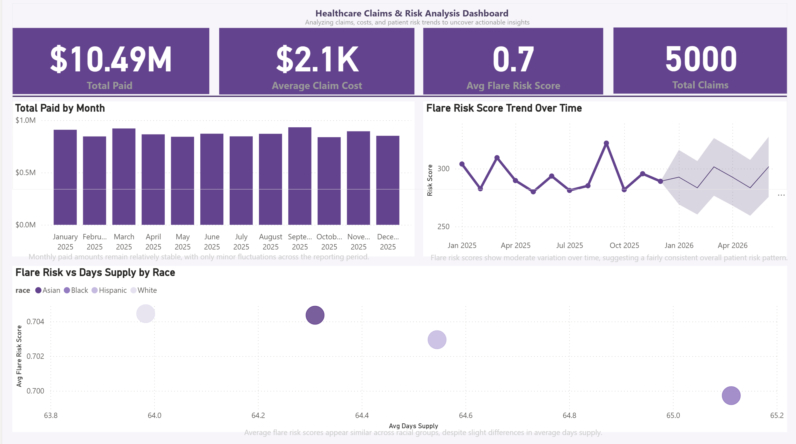

# Hi, I'm Jil 👋  
Healthcare Data Analyst | SQL • Power BI • Python  

I specialize in analyzing healthcare data to uncover insights that improve patient outcomes, reduce costs, and optimize operations.
# Jil Burton — Data Analyst Portfolio

**Remote | Healthcare Claims | SQL | Power BI | Python**

💼 Healthcare Data Analyst specializing in claims analysis, cost optimization, and patient risk insights.

---

## 🔍 Quick Navigation
| 📊 Project                         | 🛠 Tool        | 🔗 Access                                                                     |
| ---------------------------------- | -------------- | ----------------------------------------------------------------------------- |
| Medicare Denials Dashboard | Tableau Public | [View Dashboard](https://public.tableau.com/app/profile/jil.burton/viz/Medicare_Denials_Dashboard/MedicareDenialsOverview?publish=yes) |
| Revenue Cycle Performance Analysis | Excel + SQL | [Download Excel](./jil-portfolio/project-2-revenue-cycle/RevenueCycle_KPI.xlsx) |
| Revenue Cycle Data Files | Excel + SQL | [View CSV](./jil-portfolio/project-2-revenue-cycle/RevenueCycle_KPI.csv) • [View SQL](./jil-portfolio/project-2-revenue-cycle/revenue_cycle_kpi.sql) |
| Healthcare Churn Model | Python | [nbViewer](https://nbviewer.org/github/moonwalker2108/jilburtonDA/blob/main/jil-portfolio/project-3-churn/churn_model.py) |
| Financial Performance Analysis (Retail) | Power BI | [View Project](./jil-portfolio/project-4-financial-performance-analysis) • [Download PBIX](./jil-portfolio/project-4-financial-performance-analysis/festman-financial-report.pbix) |
| Healthcare Claims & Risk Dashboard | Power BI | [View Project](./jil-portfolio/project-5-claims-risk-analytics-dashboard) • [Download PBIX](./jil-portfolio/project-5-claims-risk-analytics-dashboard/claims-risk-dashboard.pbix) |

---

## 🔍 What I Do
- Analyze healthcare claims, revenue cycle, and patient data  
- Build dashboards and reports using Power BI and SQL  
- Identify trends, inefficiencies, and cost-saving opportunities  
- Translate data into actionable business insights  

---

## 🏥 Featured Projects

### 📊 Medicare Claims & Denials Analysis  
SQL | Tableau | Healthcare Analytics  

Analyzed Medicare claims data to identify denial trends, root causes, and revenue loss drivers. 

#### 🔍 Key Highlights
- Identified patterns in denied claims and payer behavior
- Analyzed financial impact of claim denials
- Built interactive dashboard to visualize denial trends

#### 💡 Business Value
- Helps reduce claim denials and revenue loss
- Supports payer negotiation and billing improvements
- Improves revenue cycle performance

#### 🛠 Tools & Techniques
- SQL (data extraction & transformation)
- Tableau (dashboard development & visualization)

🔗 [View Interactive Dashboard](https://public.tableau.com/views/Medicare_Denials_Dashboard/MedicareDenialsOverview?:language=en-US&:sid=&:redirect=auth&:display_count=n&:origin=viz_share_link)  
📁 [View Full Case Study](https://github.com/moonwalker2108/jilburtonDA/tree/main/jil-portfolio/project-1-medicare-denials)

---
### 📈 Revenue Cycle Performance Analysis  
SQL | Excel | Healthcare Operations  

Analyzed key revenue cycle metrics to evaluate billing efficiency and accounts receivable performance.

#### 🔍 Key Highlights
- Tracked DNFB and billing delays  
- Measured discharge-to-bill lag  
- Analyzed A/R aging  

#### 💡 Business Value
- Identifies revenue delays  
- Improves cash flow visibility

#### 🛠 Tools & Techniques
- SQL (data extraction and KPI calculations)
- Excel (Power Query, pivot tables, reporting)

🔗 View Project  
📁 [Download Excel](RevenueCycle_KPI.xlsx) • [View CSV](RevenueCycle_KPI.csv)  • [View SQL](RevenueCycle_KPI.sql)

---

### 🤖 Patient Churn Prediction Model  
Python | Pandas | Scikit-learn | Predictive Analytics  

Built a machine learning model to identify patients at risk of churn using behavioral and utilization-based features. This project demonstrates how predictive analytics can support proactive outreach and retention strategies in healthcare.

---

#### 🔍 Key Highlights
- Cleaned and prepared structured patient data for modeling  
- Engineered features related to engagement, utilization, and risk  
- Trained a classification model to predict patient churn  
- Demonstrated model output using a sample patient prediction scenario  

---

#### 📈 Business Value
- identify high-risk patients earlier  
- Supports targeted retention strategies and outreach efforts  
- Translates model results into actionable healthcare insights
- improves long-term patient engagement 

---

#### 🛠 Tools & Techniques
- Python  
- Pandas  
- Scikit-learn  
- Data preprocessing  
- Classification modeling  
- Model evaluation  

---

#### 📸 Model Demo

---

📁 **[View Full Project Files](https://github.com/moonwalker2108/jilburtonDA/tree/main/jil-portfolio/project-3-churn)**
---

## 🛠 Tools & Skills
SQL | Excel | Power BI | Python | Tableau | Data Analysis | Healthcare Analytics  

---
### 💰 Financial Performance Analysis (Retail)

Power BI | Financial Analytics

Analyzed retail financial data to evaluate revenue trends, profitability, and overall business performance, providing insights to support strategic decision-making.

#### 🔍 Key Highlights

* Built an interactive Power BI dashboard to track revenue, expenses, and profit performance
* Analyzed trends across time periods to identify growth patterns and fluctuations
* Developed KPIs to monitor overall financial health and operational performance

#### 📊 Key Insights

* Identified periods of declining profitability despite stable revenue
* Highlighted key revenue drivers contributing to overall performance
* Revealed opportunities to improve cost management and increase margins

#### 🛠 Tools & Techniques

* Power BI (interactive dashboard development and financial reporting)
* DAX (created calculated measures for revenue, profit, and KPIs)
* Data Modeling (structured financial datasets for analysis)
* Data Visualization (trend analysis, KPI tracking, and performance insights)

🔗 View Project
📁 [Download PBIX]

---
### 📊 Healthcare Claims & Revenue Analysis Dashboard  
Power BI | SQL | Healthcare Analytics  

Developed an interactive dashboard to analyze healthcare claims data, focusing on financial performance, claim activity, and patient risk trends. The dashboard highlights key metrics related to reimbursement, cost per claim, and clinical risk to support data-driven decision-making.

---

#### 🔍 Key Highlights
- Monitored total paid amounts over time to evaluate financial trends  
- Calculated average claim cost to assess cost efficiency per claim  
- Tracked claim volume to understand overall activity levels  
- Analyzed patient flare risk scores to evaluate clinical risk patterns  

---

#### 📈 Key Insights
- Paid claim totals remained stable month-to-month, indicating consistent reimbursement patterns  
- Flare risk trends showed minimal volatility, suggesting a steady overall patient risk profile  
- Differences in days supply did not significantly impact flare risk across demographic groups  

---

#### 🛠 Tools & Techniques
- Power BI (data visualization & dashboard design)  
- DAX (measures and calculated metrics)  
- Data modeling & KPI development  
- Data storytelling & insight generation  

---

#### 📸 Dashboard Preview

---

🔗 **[View Interactive Dashboard](https://app.powerbi.com/links/CMZCCVLJTh?ctid=6a30151e-807a-4769-badb-42396079ee39&pbi_source=linkShare)**  
📁 **[View Full Project Files](https://github.com/moonwalker2108/jilburtonDA/tree/main/jil-portfolio/project-2-revenue-cycle)**
---

## 📫 Let’s Connect
- LinkedIn: (your link)
- Email: jil.burton88@gmail.com
